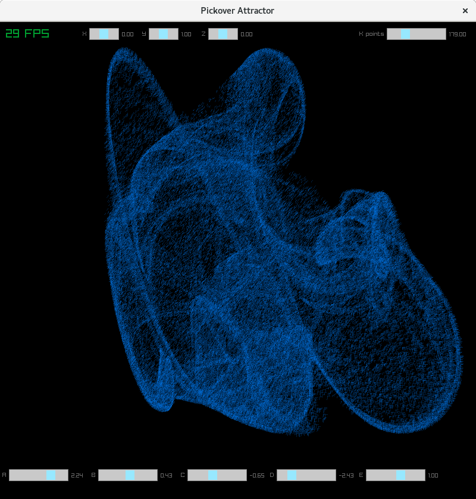
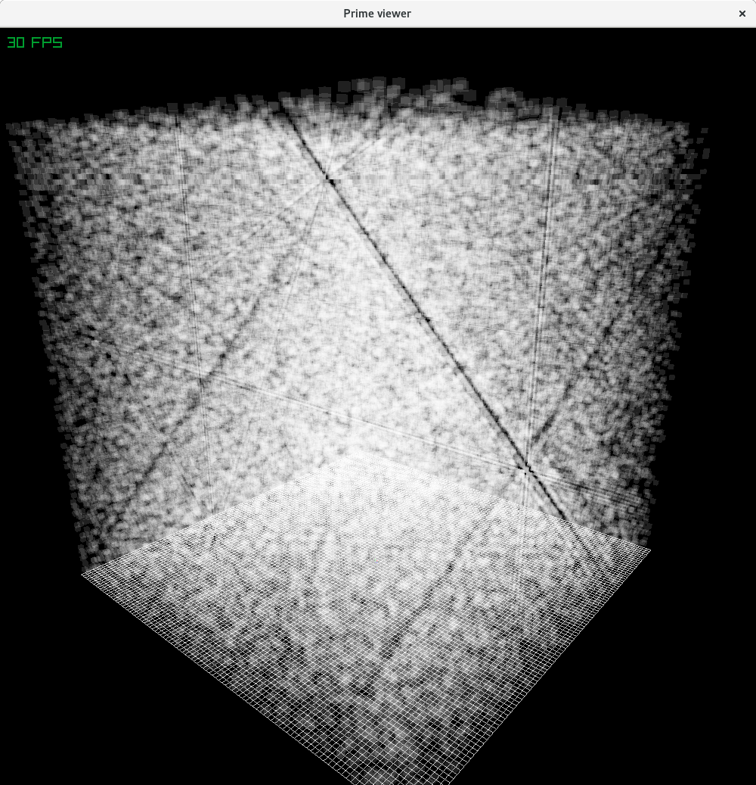
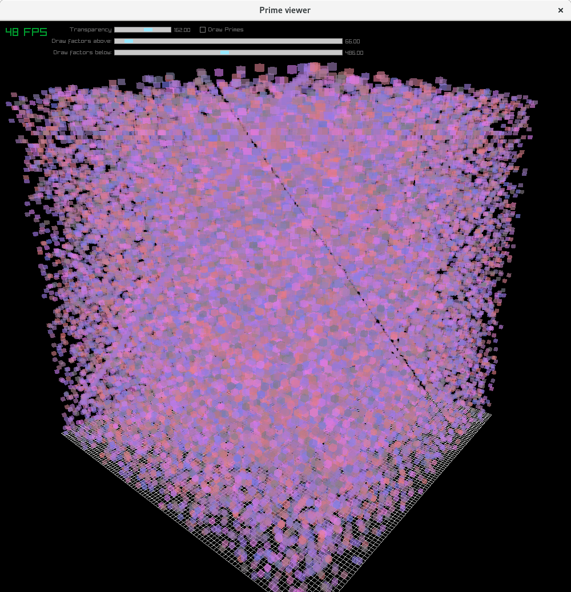

# RayLib-Examples
Some fun math or physics demos made easy with RayLib

<b>Strange Attractor:</b>
Plots the Clifford Pickover attractor, a point cloud in 3D space.
Top sliders demonstrate the fact that the system is an attractor: initial conditions don't change the shape.
Bottom sliders vary the parameters of the system, giving rise to a wide variety of attractor shapes.
Check boxes allow you to cycle through two parameters gradually to see the changes.

<b>Lorenz Attractor:</b>
Plots the Lorenz attractor using lines in 3D space.

<b>Prime Viewer:</b>
Four ways to visualize the distribution of all primes less than 1,000,000.  Press 1, 2, 3 or 4 to change view modes.
Mode 1: Plots primes as semi-transparent white cubes on a 100x100x100 grid.  Rotate and pan the view to see rows of numbers eliminated.

Mode 2: Plots primes as white cubes, other numbers are color-coded by the lowest prime factor that makes them not prime.  Primes can be turned off with check box.  Use the sliders to see how non-primes are arranged by their least common factor.

Mode 3: Wheel factorization, using sectors.  Use the spinner to choose your factor base for the wheel.
Mode 4: Wheel factorization, using points.  Same as above, but points look better for high factor bases.

<b>3D Sierpinsky Triangles IFS</b>
Uses an Iterated Function System to generate a 3D Sierpinski triangle.  (Technically, a pyramid, I suppose...)
IFS = a recursive system of affine transformations applied to random starting points, which converge to the final shape.
The shape is fractal, although visualization is limited by resolution.
, x={0,1.0} against various values of K.
This simple equation is historically important in the history of chaos theory because it was believed to be well-behaved, since for many values of k, the recursion converges to a single value of x after a few iterations.  Only later was discovered values of K for which the system alternates between two or more values.  As can be seen from the diagram, some values of K produce wild results.
To generate the usual textbook figure, keep the "split value" slider set at 64 or higher and the starting value for X anywhere.
The program computes the value of X recursively 300 times, but does not plot the value of X for the first iterations up to the "split value" after which it does plot them.  Thus, a higher split value permits visualization of stable periods.
To explore the equation's behavior in a different way, set split value to zero, which plots all values of X, and explore the polynomial curves which result from starting values of X close to 0.0 or 1.0.
The data is two dimensional only, but I used a 3D view because it provided an easy tilt, pan and zoom until I become more familiar with coding in RayLib's 2D modes.
