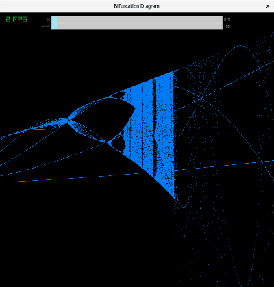

# RayLib-Examples
Some fun math or physics demos made easy with [RayLib](https://github.com/raysan5/raylib)

Note that the examples with GUIs also require [RayGui](https://github.com/raysan5/raygui), an optional companion to RayLib that is super-easy to install.

## Water Sim: Ripple Tank Physics
Simulates water in a ripple tank.  Demonstrates basic wave mechanics: wave reflection, diffraction, and superimposition.

Press "P" to pause the simulation and "R" to reset it. Left-click to add a drop to the pool, or left-click and drag to run your finger through the water. Right-click to draw boundaries.  Hold "E" while right-clicking to erase them.  Hold X to draw a straight-line boundary across the x-axis.  Hold Z for z-axis.  Hold X and E to erase a whole line.  Alter the code to add as many colored floating spheres as you'd like, or none.

## Raindrop simulator
Simulates raindrops coalescing and falling down a window pane, which I've always found beautiful.
Raindrops 2.0 brings improved collision detection with much faster performance.  Large, fast drops now leave streaks of droplets behind them on the glass.  Drop shape now changes with velocity.  The number below the frame rate is the number of drops in the simulation.  You can alter the code to change drop size and frequency.

## Audio Oscilloscope and Frequency Analyzer
Loads a wave file, plays it, and provides the following in real time:

In Red: Time-domain plot of audio amplitude (oscilloscope)

In Orange: Discrete Fast Fourier Transform of audio sample (Frequency domain plot) to Nyquist frequency, with peak dots

In Blue: The above, but gathered into logarithmically spaced bins which better indicate musical octaves, with peak bars

The code provides multiple windowing functions for the DFFT: Hann, Hamming, Blackman-Harris, Flat-top and Dolph-Chebyshev windows.  The latter is enabled by default, since it gives narrowest frequency resolution with flat sidelobe response.
Still a work-in-progress!

## Strange Attractor:
Plots the Clifford Pickover attractor, a point cloud in 3D space.

Top sliders demonstrate the fact that the system is an attractor: initial conditions don't change the shape.
Bottom sliders vary the parameters of the system, giving rise to a wide variety of attractor shapes.
Check boxes allow you to cycle through two parameters gradually to see the changes.

## Lorenz Attractor:
Plots the Lorenz attractor using lines in 3D space.  Use X, Y, Z controls to specify the initial point, which shows that the system is indeed an attractor.  One of the earliest "strange attractors" in chaos theory.

## Prime Viewer:
Four ways to visualize the distribution of all primes less than 1,000,000.  Press 1, 2, 3 or 4 to change view modes.
* Mode 1: Plots primes as semi-transparent white cubes on a 100x100x100 grid.  Rotate and pan the view to see rows of numbers eliminated.
* Mode 2: Plots primes as white cubes, other numbers are color-coded by the lowest prime factor that makes them not prime.  Primes can be turned off with check box.  Use the sliders to see how non-primes are arranged by their least common factor.
* Mode 3: Wheel factorization, using sectors.  Use the spinner to choose your factor base for the wheel.
* Mode 4: Wheel factorization, using points.  Same as above, but points look better for high factor bases.

## 3D Sierpinsky Triangles IFS
Uses an Iterated Function System to generate a 3D Sierpinski triangle.  (Technically, a pyramid, I suppose...)
IFS = a recursive system of affine transformations applied to random starting points, which converge to the final shape.
The shape is fractal, although visualization is limited by resolution.

## 3D Bifurcation Diagram of the Logistic Map
Plots the values of the logistic map recursive equation: x=kx*(1-x), x={0,1.0} against various values of K.
This simple equation is historically important in the history of chaos theory because it was believed to be well-behaved, since for many values of k, the recursion converges to a single value of x after a few iterations.  Only later was discovered values of K for which the system alternates between two or more values.  As can be seen from the diagram, some values of K produce wild results.
To generate the usual textbook figure, keep the "split value" slider set at 64 or higher and the starting value for X anywhere.
The program computes the value of X recursively 300 times, but does not plot the value of X for the first iterations up to the "split value" after which it does plot them.  Thus, a higher split value permits visualization of stable periods.
To explore the equation's behavior in a different way, set split value to zero, which plots all values of X, and explore the polynomial curves which result from starting values of X close to 0.0 or 1.0.
The data is two dimensional only, but I used a 3D view because it provided an easy tilt, pan and zoom until I become more familiar with coding in RayLib's 2D modes.

 

## Koch Curve
Generates a Koch Curve a/k/a Koch "Snowflake" by starting with an equilateral triangle, then trisecting each line, and building a smaller equilateral triangle on the middle third of each line.  The process is then repeated recursively.  Beyond 8 levels of recursion, the results are no longer visible, but the shape is rather complex.  Koch Curves have interesting properties as the number of recursions grows to infinity.  The area converges to a finite area.  The perimeter, however, grows unbounded, to infinity.  As a result, in the limit case, one has a figure with infinite perimeter surrounding a finite area, and thus an area to perimeter ratio of zero!  You can select the number of recursions using the slider.  Clicking the "analysis" checkbox will display values for the perimeter, area and area/perimeter ratio for your selected level of recursion, together with the limit values, so you can compare. A simple circle inscribing the figure helps to emphasize that the area will always be finite at higher recursion levels: the figure never grows outside the circle, even though its border grows longer exponentially.

## Apollonian Gasket Generator
Some simple code to generate an Apollonian Gasket: a fractal that recursively packs a space with tangential circles.

## Linear Interpolation between Cartesian and Polar coordinates
Lerp *all* the things!  Quick and dirty linear interpolation between two sets of points.  The first shows a sine function plotted in yellow upon a Cartesian grid.  The second shows the same function plotted against polar coordinates.  There are certainly more elegant ways to do this.  I made it simply because I wondered what a gradual tranformation to polar would look like.  It looks much smoother in the program, but I had to keep the image file size down.

